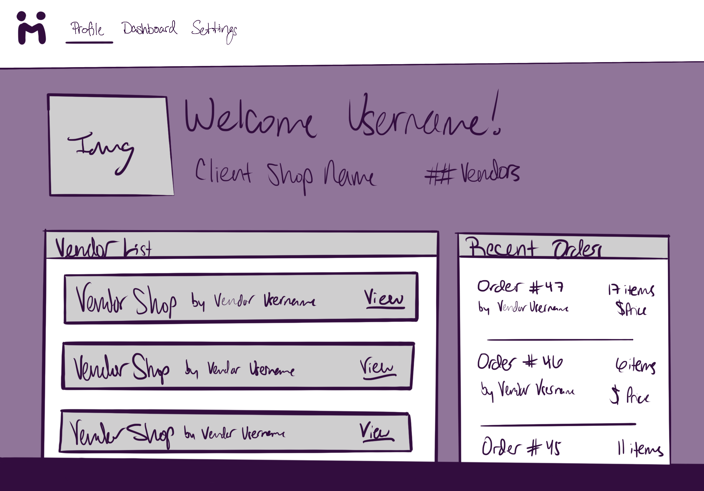
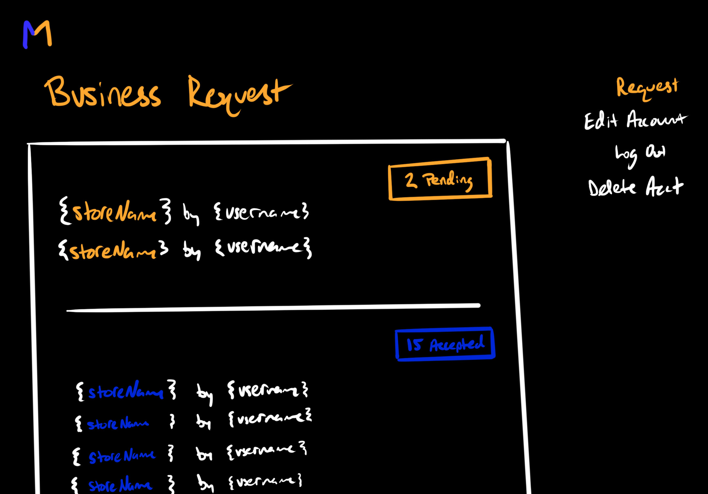
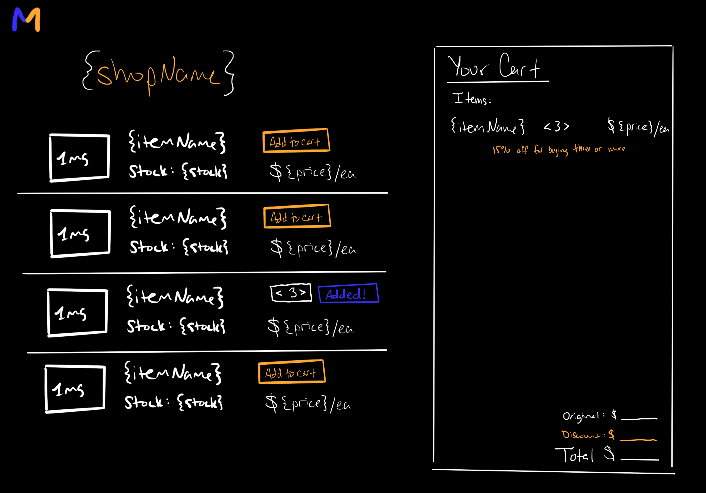

# The Middle Man

## Project Summary

The desired outcome of this application is to connect small businesses to wholesale vendors in a unified way. As a client or vendor, I want to see all my business partner's information, find new partners, edit submit an order OR edit inventory, and have a centralized location for invoices.

---

## Table of Contents

- [Developers](#developers)
- [MVP](#MVP)
- [Installation Instructions](#installation-instructions)
- [Database Relations](#database-relations)
- [Tech Stack](#tech-stack)
- [Stretch Goals](#stretch-goals)
- [Contact Information](#contact-information)

---

## Developers

1. Andrew Hudgins
2. Morgan Holcomb

## MVP

The MVP includes a landing page where the user is prompted to sign up or log in. Once authenticated, the user can access their profile- consisting of: shop name, username, description, phone and email. A business card of sorts. The profile also displays a list of the user's business partners and the user's recent orders. The user can search and request for business partners. Lastly on Settings, the user can decide request, edit their information, log out or delete their account.

As a client, you should also be able to look at business partner's inventories and order from them- recieving an invoice to populate the recent orders.

As a vendor, you should be able to input items to create your inventory and offer discounts based off bulk purchases.

While all operations are not functional, we have mocked up the idea behind them.

Mock Up Design for MVP

Mock Up Design for the Business Partner Request

Mock Up Design for the Shopping Cart

## Installation Instructions

Clone the repository to your local computer. Before running the program, install the _npm dependencies_ with:

npm run install

 
 Then, type in the command line:
  

npm run seed

 
to seed the data. Finally type:
  

npm run develop

 
in the command line of the root directory to launch the server. The application should open after the command is completed.
  

## Tech Stack

- MERN

## Stretch Goals

- Allow price breaks from vendor when the client orders bulk.
- Allow discounts from the developer to increase incentive.
- Offer ads from our vendors to display on the application itself for free- more incentive.

## Contact Information

Here is a link to our deployed application on [Heroku](https://stark-ridge-51286.herokuapp.com/).

For more of our work, check out our GitHub's!

- [Andrew Hudgins](https://github.com/AHudg)
- [Morgan Holcomb](https://github.com/Morgan1317)
